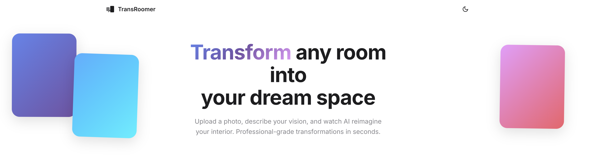
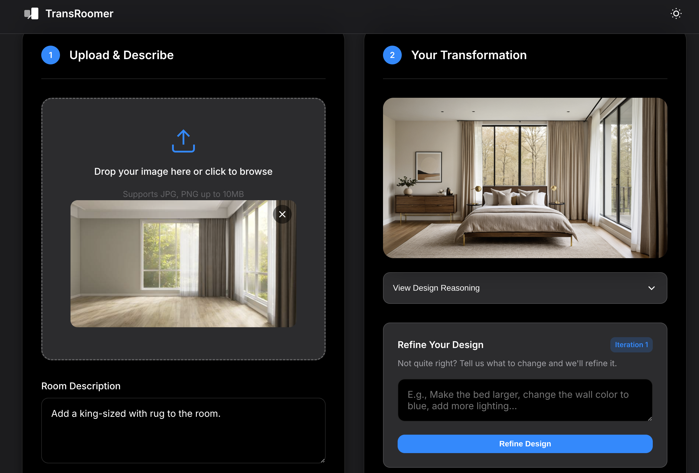
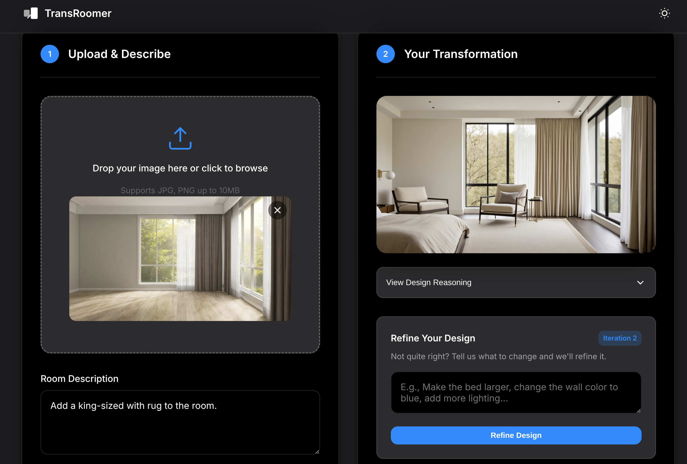

# TransRoomer
_**This is a fork of the [Xd06eR/virtual-staging-ai](https://github.com/Xd06eR/virtual-staging-ai)** that provides integrated solutions for transformer and difussion models enabled interior designing._
<br><br>Instead of relying on traditional interior designing solution like 3D modeling. We utilize SOTA models in helping you realize full potentials of every *mojodojo casa house*.
<p align="center">

</p>

## Fork Characteristics
- [x] OpenAI Compatible Server support
- [x] Chain-of-Thought (CoT) based prompt enhancing
- [x] Vision-Language Model (VLM) based prompt enhancing
- [x] ~~Streamlit~~ Traditional HTML, CSS, and JS based front-end
- [x] **Refinement**: Support tweaking of generated image details through multi-round conversation
- [ ] Switch to Z-Image-Turbo and Union ControlNet for image generation (High VRAM)
## Quick Start
1. Clone the repository
```bash
git clone https://github.com/AnaOnTram/TransRoomer.git && cd TransRoomer
```
2. Dependencies
 ```bash
 pip install torch==2.9.1 torchvision torchaudio xformers openai fastapi uvicorn python-multipart
 ```
3. ComfyUI <br>
*You may follow [ComfyUI official repo](https://github.com/Comfy-Org/ComfyUI) and install corresponding version based on your GPU vendor*. Please also install [ComfyUI manager](https://github.com/Comfy-Org/ComfyUI-Manager) for custom node installation:
    * `comfyui_controlnet_aux` 
    * `wlsh_nodes`
4. Prompt Enhancing Model serving
<Stong>You may choose any model engine that follows OpenAI standards.</Storng> For illustration purpose, llama.cpp was used.
```bash
# Download model files
cd ~/
mkdir Qwen3VL && cd Qwen3VL
wget https://huggingface.co/Qwen/Qwen3-VL-4B-Instruct-GGUF/resolve/main/Qwen3VL-4B-Instruct-Q4_K_M.gguf
wget https://huggingface.co/Qwen/Qwen3-VL-4B-Instruct-GGUF/resolve/main/mmproj-Qwen3VL-4B-Instruct-F16.gguf

# Serve the model
llama-server -m ~/Qwen3VL/Qwen3VL-4B-Instruct-Q4_K_M.gguf --mmproj mmproj-Qwen3VL-4B-Instruct-F16.gguf --jinja -fa auto -c 8000
```
5. Start the main service
```bash
python run.py
```

## Sample Run
* First round effect (User prompt: Add a king-sized with rug to the room.)
<p align="center">

</p>

* Refinement (User Prompt: Add a chair next to the bed)
<p align="center">

</p>
